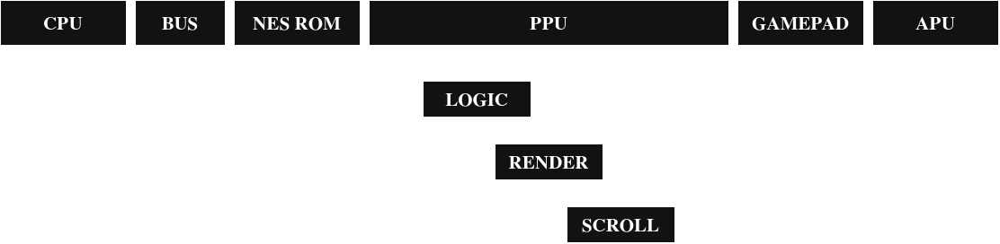
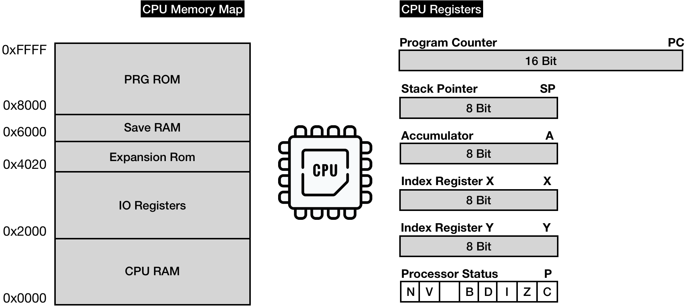

# nest

## Motivation and first stones

***nest***, standing for *NES in Rust*, is my introduction of *NES* platform emulation, based on [bugzmanov's guide](https://bugzmanov.github.io/nes_ebook/chapter_2.html) on "How to build a NES emulator", but with my own Rust taste (more or less, I'm an emulation toddler lol).

This project serves my selfish thirst for learning more about **retro gaming platforms**, and *NES* is one good candidate when it comes to emulating OS-less platforms, running machine language-coded ROMs on bare hardware.

## Why NES?

*NES* runs *without* any operating system, which removes some software overhead. 

Games run through proprietary machine language directly fed onto hardware, and thus gives this project a rather straightforward approach for an emulation-beginner like me.

## Note

I insist on the fact that the main building stone of this project is **bugzmanov's guide**, who actually did the hard part of documenting the platform for me and teach toddler fans how this platform-specific emulation model works.

## Hardware

NES official hardware specs state the following (summarised by **bugzmanov**):

- **Central Processing Unit** (CPU) - the NES's 2A03 is a modified version of the 6502 chip. As with any CPU, the goal of this module is to execute the main program instructions.

- **Picture Processing Unit** (PPU) - was based on the 2C02 chip made by Ricoh, the same company that made CPU. This module's primary goal is to draw the current state of a game on a TV Screen.

- Both **CPU** and **PPU** have access to their 2 KiB (2048 bytes) banks of Random Access Memory (RAM)

- **Audio Processing Unit** (APU) - the module is a part of 2A03 chip and is responsible for generating specific five-channel based sounds, that made NES chiptunes so recognizable (*not planned as part of the emulator for now*)

- **Cartridges** - were an essential part of the platform because the console didn't have an operating system. Each cartridge carried at least two large ROM chips - the Character ROM (CHR ROM) and the Program ROM (PRG ROM). The former stored a game's video graphics data, the latter stored CPU instructions - the game's code. (in reality, when a cartridge is inserted into the slot CHR Rom is connected directly to PPU, while PRG Rom is connected directly to CPU) The later version of cartridges carried additional hardware (ROM and RAM) accessible through so-called mappers. That explains why later games had provided significantly better gameplay and visuals despite running on the same console hardware.

- **Gamepads** - have a distinct goal to read inputs from a gamer and make it available for game logic. As we will see later, the fact that the gamepad for the 8-bit platform has only eight buttons is not a coincidence.

CPU, PPU and APU are independant from each other on this platform. 

### Components and roles

Pieces of hardware share the whole frame while serving distinct goals, as this chart summarises:

### CPU

The CPU emulated follows the following hardware construction (memmap and registers):

